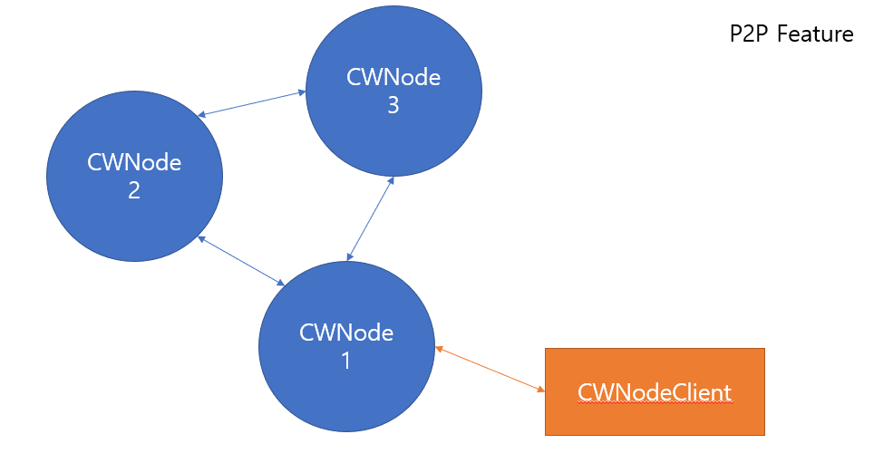
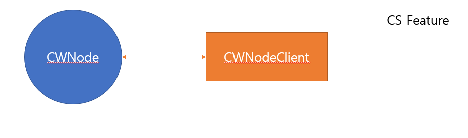

# TCPModule
> Java TCP Module for developing CS/P2P logic using Netty FrameWork.

Making TCP Application has usully two difficulties.

The first is defining and parsing TCP Message boundary logic, Secondary is handling endian problem.

This project is for understanding these two agenda and providing the sample codes. 




## Performance
1. Server resource

One n1-standard-2(vCPU x2, 7.5GB memory) instance on GCP

Application - One ServerNode


2. Client resource

CPU - Intel(R) Core(TM) i7-7500U CPU @ 2.7GHz 2.9GHz

memory - 32G

OS - Win10 Pro

Application(Benchmark scenario that I used is in "CWNodeClient" class in this project) - 1 thread


3. Result

100 bytes packet, total 100,000 req / Each return 100 bytes packet => 40,000 TPS

300 bytes packet, total 100,000 req / Each return 300 bytes packet => 14,380 TPS

2K  bytes packet, total 100,000 req / Each return 2K  bytes packet => 4,730 TPS


## You can just run the Runnable jar that I committed for test

```sh
# 1. Make property file like this. location is {jar file location}/config/node.properties..
# my ip
ip=192.168.0.4
# my port
port=8890
# other node {ip:port} list.
targetNodeList=192.168.0.140:8891,192.168.0.4:8892
```

```sh
# 2. 
# Make Runnable jar file with "CWNode" class in "com.cw.node"
# Or just download tcpmodule-{version}.jar
# 
# And run.
java -jar tcpmodule-{version}.jar

# Or you can add jvm parameter like this when you run jar file, for trouble shooting Netty Memory leak
java -Dio.netty.leakDetectionLevel=advanced -jar tcpmodule-{version}.jar

# Or for remote jconsole monitering
java -Dcom.sun.management.jmxremote=true -Dcom.sun.management.jmxremote.port={YOUR_JMX_PORT} -Dcom.sun.management.jmxremote.rmi.port={YOUR_JMX_PORT} -Dcom.sun.management.jmxremote.ssl=false -Dcom.sun.management.jmxremote.authenticate=false -Djava.rmi.server.hostname=192.168.0.140 -Dcom.sun.management.jmxremote.authenticate=false -jar tcpmodule-{version}.jar


# 3. Use client source to send TEST message to server in [Usage example] - [2. Client example] Section.
```

## Usage example

1. Server Node example
```java
// Server Node example..
// You have to use correct {your_ip}:{your_port} that other CWNodes can detect on the internet.
// This server node example will access infinitely to make connection with CWNode 192.168.0.140:8891 until success.
String myip = {your_ip};
int myport = {your_port};
CWNode cwnode1 = new CWNode(myip, myport, new CWCommunicationCallback() {
			
   @Override
   public void connectionFailure(Object obj) {

      System.out.println("cwnode1's connectionFailure callback..!");
   }

   @Override
   public void sendDataFailure(Object obj, CWConnProtocol data) {

      String msg = (String) obj;
      System.out.println("cwnode sendData request is Failed ::"+msg);
   }
});
cwnode1.addConnector("192.168.0.140", 8891); // you can add more target CWNode as much as you want.

cwnode1.start();

// If you want to blocking until my server down, you can use block() method.
cwnode1.block();
```

2. Client example
```java
// Client example..
// I make client using java default BlockingIO Socket class.
// It has sync/async mode.

// 1. Sync Mode Client
String targetNodeIp = {CWNode IP that you want to access}
int targetNodePort = {CWNode PORT that you want to access}

CWNodeClient client = new CWNodeClient(
	targetNodeIp
	, targetNodePort
)
.connectSyncMode();

// Send and receive message using TEST protocol.
// TEST protocol is a sample protocol implementing echo server logic.
// you will receive TEST_ACK message from server.
JsonObject msg_json = new JsonObject();
msg_json.addProperty("a", "asdf");
CWConnProtocol packet = client.send(ProtocolVal.TEST, msg_json.toString());

// show what client received.
String receivedPacketLog = "\n" + "<<<----- RECEIVED PACKET ----->>>";
receivedPacketLog += "\n" + "Protocol : " + packet.getProtocol();
receivedPacketLog += "\n" + "Data : " + new String(packet.getData(), 0, packet.getData().length, "UTF-8");
receivedPacketLog += "\n" + "<<<--------------------------->>>\n";
System.out.println(receivedPacketLog);

...

// disconnect from server.
client.disconnect();

// --------------------------------------------------------------------------------------------------

// 2. Async Mode Client
String targetNodeIp = {CWNode IP that you want to access}
int targetNodePort = {CWNode PORT that you want to access}

CWNodeClient client = new CWNodeClient(
	targetNodeIp
	, targetNodePort
)
.connectAsyncMode(new CWNodeClientCallback() {
	
	@Override
	public void receivedData(Object obj) {
		try {
			CWConnProtocol packet = (CWConnProtocol) obj;
			
			// show what client received.
			String receivedPacketLog = "\n" + "<<<----- RECEIVED PACKET ----->>>";
			receivedPacketLog += "\n" + "Protocol : " + packet.getProtocol();
			receivedPacketLog += "\n" + "Data : " + new String(packet.getData(), 0, packet.getData().length, "UTF-8");
			receivedPacketLog += "\n" + "<<<--------------------------->>>\n";
			System.out.println(receivedPacketLog);
		} catch(UnsupportedEncodingException ue) {
			
		}
					
	}
	
	@Override
	public void connectionFailure(Object obj) {
		Exception e = (IOException) obj;
		e.printStackTrace();
		
	}
});

// Send and receive message using TEST protocol.
// TEST protocol is a sample protocol implementing echo server logic.
// you will receive TEST_ACK message from server on your CWNodeClientCallback.
JsonObject msg_json = new JsonObject();
msg_json.addProperty("a", "asdf");
client.send(ProtocolVal.TEST, msg_json.toString());

...

// disconnect from server.
client.disconnect();
```

## Development setup

you have to install java runtime.( 1.8 )

## TCP Protocol explanation
I designed tcp protocol shape like this.

[ HEADER ] [ PROTOCOL ] [ DATA ]

the "HEADER" field is a length of "DATA" field. it is 2bytes.

the "PROTOCOL" field is a classification value that help CWNode use "DATA" in correct purpose as you want. it is 1byte.

the "DATA" field is a data for business logic in your application. it has different bytes every time that time

## Release History

* 0.0.1
    * Work in progress.. 
* 0.0.2
    * Update to latest version of Netty. [ netty-all-4.1.27.Final.jar --> netty-all-4.1.50.Final.jar ]
    * add network connection check logic
(if no send/recv message between peers, send heartbeat message each other. and if no heartbeat return message from the other party, peer do close the connection.)
* 0.0.3
    * Change a java json parser library. ( BGehrels/JSON-java => Gson )
    
I will add two features big/little endian logic and injecting your own Netty handler logic in later version.

## Meta

dktsudgg – dktsudgg@gmail.com

Distributed under the Apache License 2.0. See ``LICENSE`` for more information.

[https://github.com/dktsudgg/TCPModule](https://github.com/dktsudgg/TCPModule)
